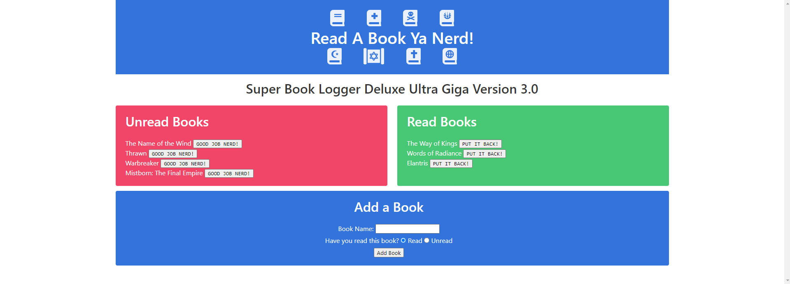
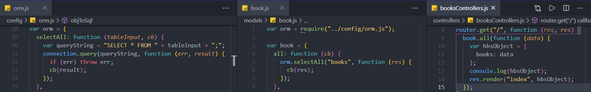

# Read a Book Ya Nerd!  [](https://opensource.org/licenses/MIT) 
##### This readme has been procedurally generated 



-----------------------
## Table of Contents
1. [Description](#description)
2. [Deployed link](#deployed-link)
3. [Installation](#installation)
4. [Usage](#usage)
5. [Code snippets](#code-snippets)
6. [Licenses](#licenses)
7. [Contributing](#contributing)
8. [Tests](#tests)
9. [Questions](#questions)

-----------------------
## Description
A simple book tracker. Add books you want to read and move them to the list of read books when completed.

-----------------------
## Deployed link
https://read-a-book-ya-nerd.herokuapp.com/

-----------------------
## Installation
To install locally, download repo and install dependencies using the following command:
```
npm install
```

-----------------------
## Usage
To use this repo you will need a working knowledge of Javascript and Node. 

To run this tool use the following command. This will generate a markdown file in the root folder with the name of 'READMETOO.md'

```
node server.js
```
-----------------------
## Code snippets

This project highlights the use of the Model-View-Controller or MVC framework. The idea is to separate the code into 3 main sections as per the name of the framework. The server side handles the model and the controller parts of the framework.

As yuou can see in the picture, the controller handles the routing of the paths. It then calls the model via 'book.all' in the example below which in turn calls the orm parent class handing the all the relevant field data so taht the ORM can run the MySQL query and return the data. 



The View part of the framework is handled by the client side javascript and html/css. As seen in the code snippet below, when clicking on the button associated with '.create-form', the client grabs the the book name and the status of the book from the webpage and passes it along in the ajax call to the controller. 

```javascript
$(".create-form").on("submit", function (event) {
	event.preventDefault();
	var newBook = {
		book_name: $("#bo").val().trim(),
		devoured: $("[name=devoured]:checked").val().trim()
	};
	$.ajax("/api/books", {
		type: "POST",
		data: newBook
	}).then(function () {
		console.log("created new book");
		location.reload();
	});
});
```

-----------------------
## Licenses
This project uses a [MIT License](https://opensource.org/licenses/MIT). 

-----------------------
## Contributing
If you would like to contribute, you will need to know Javascript, Node JS, mySQL, MVC framework.

-----------------------
## Tests
To run tests run the following command:
```javascript
NA
```

-----------------------
## Questions
Created by Muhammad A Khalid

If you have any questions you can reach me at the following email: [akhalid.code@gmail.com](mailto:akhalid.code@gmail.com)

Follow my other work at GitHub: https://github.com/akhalid88/
